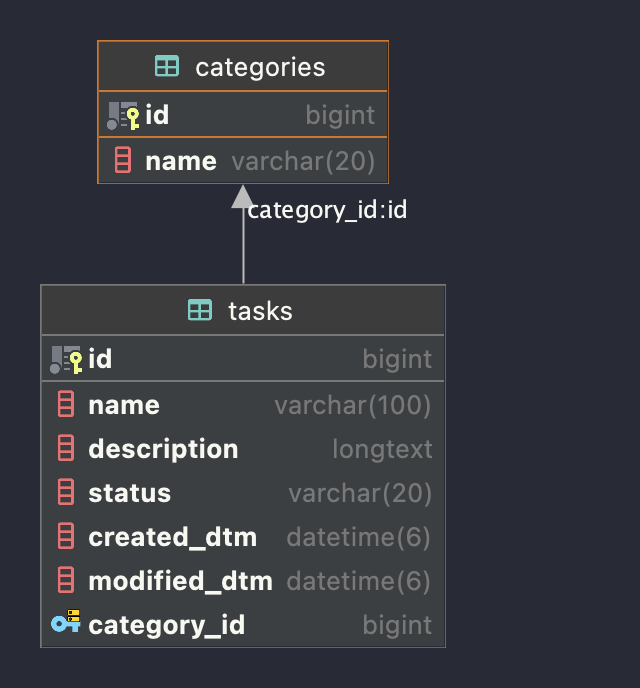

# To Do List

## 개요

- Task CRUD 기능을 포함한 To Do List 서비스

## 기능

- Task 생성, 목록 조회, 상세 조회, 수정, 삭제

## 기술
### Backand

- Kotlin
- Spring Boot
- Spring JPA
- H2
- MySQL

## ERD

## API

### Task

| URL               | Method   | Description | 비고                     |
|-------------------|----------|-------------|------------------------|
| `/tasks`          | `POST`   | Task 생성     | 카테고리는 별도의 테이블에 저장      |
| `/tasks`          | `GET`    | Task 목록 조회  | Task ID, 이름, 상태, 카테고리명 |
| `/tasks/{taskId}` | `GET`    | Task 상세 조회  | Task 전체 정보 + 카테고리명     |
| `/tasks/{taskId}` | `PUT`    | Task 정보 수정  | 카테고리명 수정 가능            |
| `/tasks/{taskId}` | `DELETE` | Task 삭제     | 카테고리 미삭제               |
